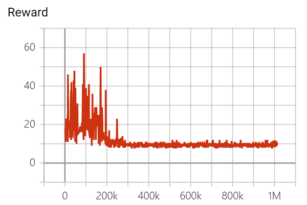

## Introduction

CartPole 문제를 [DQN](https://deepmind.com/research/publications/playing-atari-deep-reinforcement-learning)으로 해결하는 코드가 주어졌습니다.

하지만 버그로 인해 정상적으로 학습이 진행되지 않는 상태입니다.

숨은 버그를 해결한 코드와 이에 대한 레포트를 제출해주세요!

### 환경설정

1. `pip install -r requirements.txt` 를 실행합니다.
2. https://pytorch.org/ 에 방문해 자신의 환경에 알맞은 파이토치를 설치합니다. 파이토치의 버전은 1.4.0 을 사용하면 됩니다.
GPU가 없는 경우 CPU-only 버전을 설치해도 괜찮습니다.

## Tasks

### 1. 버그 수정 (총 7점)

기존 코드에 있는 버그를 모두 수정하는 것이 목표입니다. 

- 버그를 수정할 때는 왜 해당 부분이 버그인지에 대한 이유와 어떻게 고쳤는지, 왜 그렇게 고쳤는지를 레포트에 명시해주세요.

- 버그는 단순 오타에서부터 당장 수정하지 않으면 학습이 불가능한 크리티컬 한 것도 있고, 지금 당장은 영향을 주지 않아도 학습의 스케일이 커졌을 때 문제가 되는 것도 있습니다.

- 모든 버그를 수정한 후 `python main.py --train` 을 실행하면 200점 만점을 달성해야 합니다.

- 위의 명령어를 실행하면 `runs` 폴더가 생기는데, `runs` 의 부모 폴더 경로에서 `tensorboard --logdir runs` 를 실행하면 http://localhost:6006/#scalars 에서 그래프를 볼 수 있습니다.

※ 이 단계에서 `main.py` 는 수정할 필요가 없습니다.

### 2. L1 loss 사용하기 (최대 6점)

버그를 모두 수정한 후 `python main.py --train` 을 실행하면 텐서보드에서 아래 그림과 같은 reward 그래프를 볼 수 있습니다.

  </img>

그런데 `python main.py --train --loss_fn L1` 을 실행하면 reward 그래프가 아래와 같이 변하게 됩니다.

  </img>

코드의 어떤 부분을 고쳐야 L1 loss를 사용했을 때 200점을 달성할 수 있는지 찾아주세요.

- 서로 다른 해결 방식을 제시할 때마다 2점, 제시한 방식이 기존의 어떤 문제를 해결하는지, 왜 작동하는지 이유를 설명할 때마다 2점이 추가됩니다.

- 즉 세 가지 서로 다른 해결 방식을 제시하면 6점, 두 가지 방식을 제시하고 한 가지에 대해서만 이유를 설명해도 6점입니다.

※ 이 단계에서 `main.py` 는 수정 가능합니다.

### 3. Load & Save & Play 구현 (총 3점)

Load, Save, Play 기능을 구현해주세요.

- Save는 주어진 경로에 현재 학습 상황을 저장하는 것을 뜻합니다. 학습 상황에는 Neural Net Weight, Optimzer state, Replay Memory 등이 포함됩니다.

- Load는 주어진 경로에 저장되어 있는 학습 상황을 불러오는 것입니다. 불러온 시점에서부터 학습을 재개할 수 있어야 합니다.

- Play는 저장된 weight를 기반으로 inference를 진행하는 것을 뜻합니다. 즉 학습이 완료된 모델을 사용해 새로운 에피소드를 몇번 진행하고, 점수가 어떻게 나오는지 관측하는 코드를 추가하시면 됩니다.

- 각 기능을 구현할 때마다 1점이 추가됩니다.

※ 이 단계에서 `main.py` 는 수정 가능합니다.
